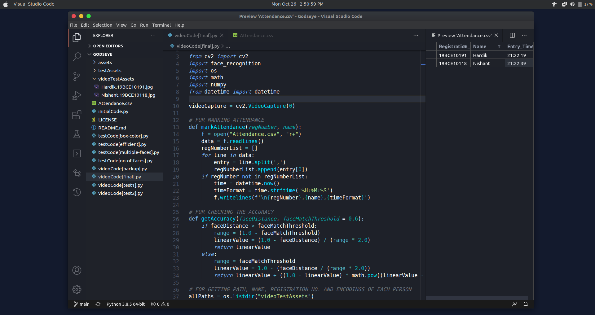

## Project Description
Godseye is an **AI based project** working on the principle of **Computer Vision**.  
Using digital images and live feed it detects and **recognizes human face** and **mark their attendance**.  
The sole purpose of this model is to detect a person and add their details separately in Attendance list.  

## Novelty
- Instead of working on a single face, our model can **recognize multiple face in one frame**.
- Our model not only recognizes a face but also **mark attendance** of that recognized person.
- Our model update Attendance list in **real-time** (as soon as it recognizes a person).

## Real-time Usage
- Firstly, we **open the webcam** to take images of people present in front of the camera.
- Then we **check** each of them if they exist in our data or not. If not, they'll be called as 'Unknown'.
- After checking each of them with our data, we check that if they already **marked as present** or not. If not, we take that person's Registration no., Name & Entry time and mark them present.

## Hardware & Software Requirements
1. **Hardware**: Desktop or laptop with a webcam installed
2. **Minimum Specs**: 4gb RAM and 80gb HDD dual core processor
3. **OS**: macOS or Linux (Windows not officially support 'face_ recognition' library, but it might work)
4. **Programming Language**: Python 2.7 or Python 3.3+
5. **Application**: 'Spreadsheet' in macOS or 'LibreOffice Calc' in Linux

## Screenshot of Project

## Testing
1. We started our project with **testing face recognition** in different images by Image Recognition.
2. Then we **developed an algorithm** to find the location and encodigs of multiple faces in one frame.
3. After that we **wrote the code** by importing all the required libraries & our developed algorithms.
4. After recognizing the face, we are **checking that person's details** and finding it's accuracy.
5. At last we made .csv file in which we are **storing the attendance** of the recognized people.

## Result & Discussion
- This method can detect multiple face in one frame and can be easily used in a classroom or in an office.
- This system helps us to achieve desired results with better accuracy and less time consumption.
- The precision or the accuracy of face recognition of our model is almost **more than 90%**.

## Conclusion
Thus, the aim of this model is to capture the video of the
students/colleagues, convert it into frames, relate it with the dataset to
ensure their presence or absence, mark attendance to the
particular student/colleagues to maintain the record. The Automated
Classroom Attendance System helps in increasing the
accuracy and speed ultimately achieve the high-precision
real-time attendance to meet the need for automatic
classroom evaluation.

## Steps to Run
- Each **.py** file has a specific work to perform (Commented in the starting of that file) and **videoCode[final.py]**
1. Fork this repo
2. Clone the forked repo to your local system
3. Install the following libraries: (in **Linux** or **macOS**)
   1. `cv2`
   2. `face_recogniton`
   3. `os`
   4. `math`
   5. `numpy`
   6. `datetime`
4. Run the code

## Support
If you like this project, don't forget to give it a ⭐
